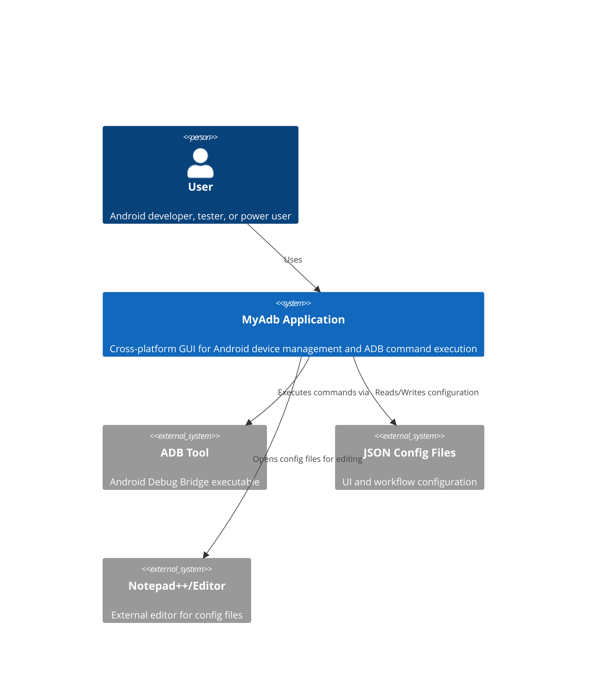
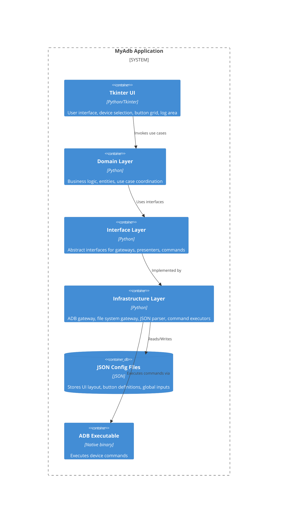

# MyAdb Application - Architecture Document

**Date:** July 11, 2025

---

## 1. Architectural Vision and Goals

The architecture of MyAdb is driven by the following principles:
- **Scalability:** Support multiple devices and extensible features.
- **Maintainability:** Clean separation of concerns, modular components, and interface-driven development.
- **Security:** Restrict file operations, sanitize user inputs, and ensure safe command execution.
- **Reliability:** Robust error handling, fail-safe execution, and comprehensive logging.
- **Usability:** Responsive, intuitive UI with real-time updates and clear feedback.

---

## 2. Architectural Style

### Selected Pattern: **Monolithic Clean Architecture (MVP for UI)**

#### Definition
Monolithic desktop application organized by Clean Architecture: domain, interfaces, infrastructure, and presentation layers. MVP pattern for Tkinter UI.

#### Justification
- **Simplicity:** Optimal for desktop GUI, reduces deployment complexity.
- **Maintainability:** Enforces separation of concerns, easier to test and extend.
- **Performance:** In-process communication, low latency.
- **Extensibility:** Modular design for future enhancements.
- **Suitability:** Matches requirements for dynamic UI, device management, and local command execution.

---

## 3. System Diagrams

### C4 Model Context Diagram (Mermaid.js)

### Container Diagram (Mermaid.js)

---

## 4. Technology Decisions

| Technology         | Rationale                                                                 | Benefits                                              | Risks & Mitigation                      |
|-------------------|---------------------------------------------------------------------------|-------------------------------------------------------|-----------------------------------------|
| Python 3          | Mature, cross-platform, rich ecosystem, ADB integration                   | Rapid development, strong libraries, easy packaging   | Dependency issues: use virtualenv, requirements.txt |
| Tkinter           | Native Python GUI, no external dependencies                               | Simple, reliable, cross-platform                      | Limited UI features: custom widgets if needed |
| JSON              | Human-readable, flexible configuration                                    | Easy editing, dynamic UI, no DB overhead              | Corruption: validate on load, backup files |
| PyInstaller       | Standalone packaging for desktop distribution                             | Simple deployment, no install required                | Packaging errors: test builds on all targets |
| ADB Executable    | Industry-standard for Android device management                           | Reliable device control, broad compatibility          | Version mismatch: bundle tested ADB binary |
| Notepad++/Editor  | External config editing                                                   | Familiar editing experience                           | Editor not installed: fallback to default editor |

---

## 5. Data Management Strategy

- **Storage:**
  - All configuration and UI data stored in local JSON files. No external database required.
  - Log data kept in memory during runtime; optionally exported to text files.
- **Access:**
  - Configuration files read at startup and on reload; edits via external editor or in-app UI.
  - File operations restricted to user-accessible directories.
- **Management:**
  - JSON schema validation on load to prevent corruption and ensure integrity.
  - Backups of configuration files created before edits.
- **Database Choice:**
  - NoSQL (JSON files) for flexibility and ease of editing. SQL not required.
- **Caching:**
  - In-memory caching of device lists, configuration, and logs for fast UI updates.
  - No distributed cache; all data is local to the application instance.

---

**End of Architecture Document**
